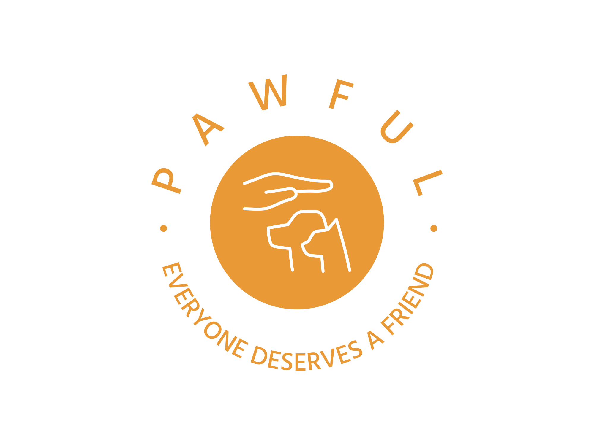

### Pawful will be a crowdfunding website for people who are differently able, old or from low income households. It's also open to animal shelters struggling to keep their centres alive and retirement homes looking to adopt lots of pets. A crowdfunding project can be starting pending that the pets can be homed comfortably. 
### In second phase we will partner with animal shelters to make it easier for organizations/people looking shorter term options (fostering or for small petting events) and offer easier crowdfunding for such events.

<ins>User Account (crowfund starter)</ins>
- username
- password
- email address
- organisation (optional)

<ins>Organisation Account</ins>
- organisation
- password
- email

<ins>User Account (pledger)</ins>
- username
- password
- email address
- funds pledged to

<ins>Fund/Project</ins>
- project name 
- owner
- description
- images
- goal amount
- date until funds can be given
- project updates
- when project was created
- on going fundraiser (optional)
- ability to return funds if fundraiser fails

<ins>Pledges</ins>
- amount
- project to be pledged to
- pledger
- anonymous/not
- comment
- ability to withdraw a pledge

<ins>Wireframe</ins>
<iframe style="border: 1px solid rgba(0, 0, 0, 0.1);" width="800" height="450" src="https://www.figma.com/embed?embed_host=share&url=https%3A%2F%2Fwww.figma.com%2Ffile%2FclpS93ibRYvn7rMfaZDitT%2FUntitled%3Ft%3DrIAcUkSVs7YfDuzU-1" allowfullscreen></iframe>
<ins>Database Schema</ins>

  <iframe loading="lazy" style="position: absolute; width: 100%; height: 100%; top: 0; left: 0; border: none; padding: 0;margin: 0;"
    src="https:&#x2F;&#x2F;www.canva.com&#x2F;design&#x2F;DAFX1opb0qU&#x2F;view?embed" allowfullscreen="allowfullscreen" allow="fullscreen">
  </iframe>

<ins>API Specifications</ins>

  <iframe loading="lazy" style="position: absolute; width: 100%; height: 100%; top: 0; left: 0; border: none; padding: 0;margin: 0;"
    src="https:&#x2F;&#x2F;www.canva.com&#x2F;design&#x2F;DAFX1gSNiOA&#x2F;view?embed" allowfullscreen="allowfullscreen" allow="fullscreen">
  </iframe>

